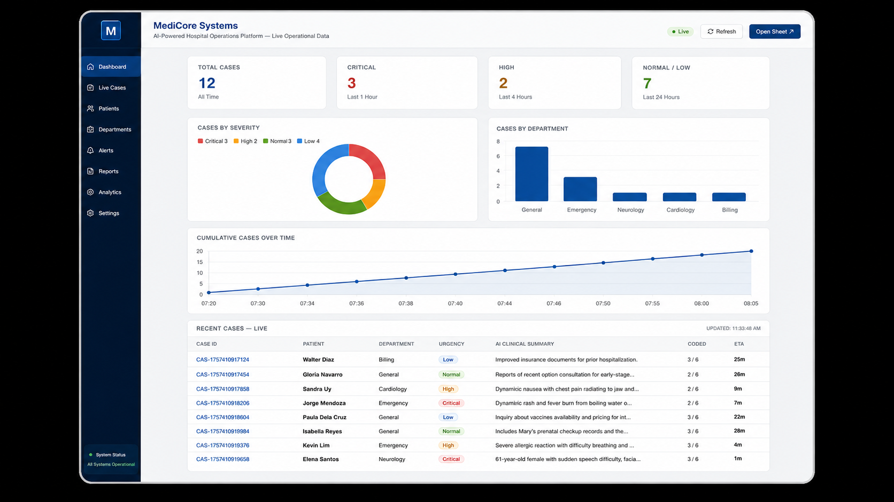
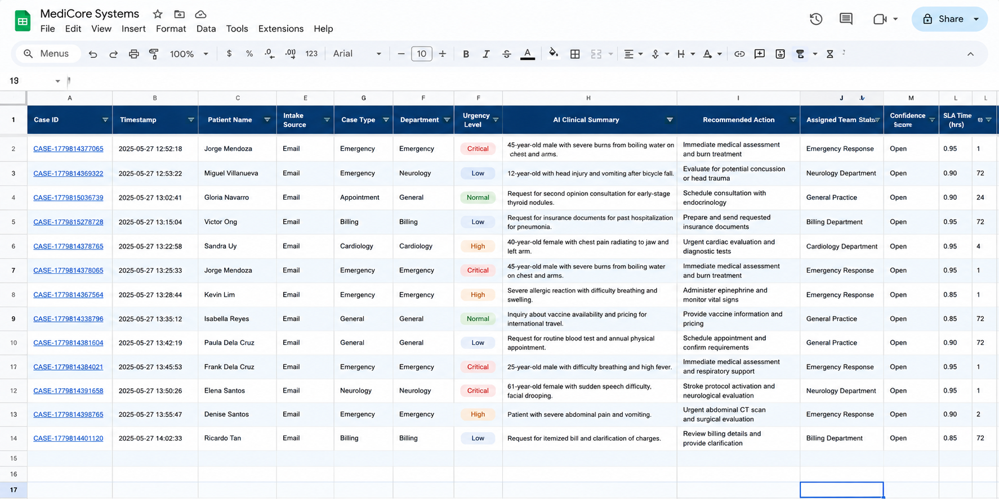
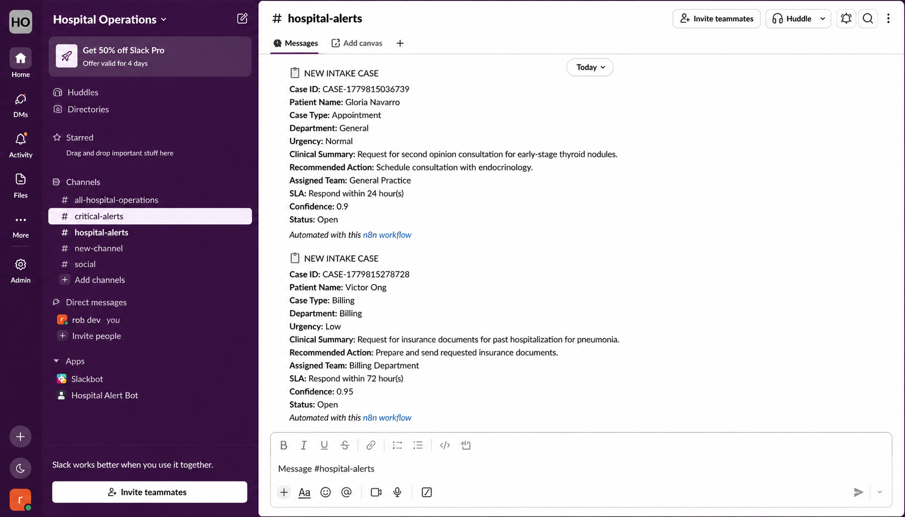
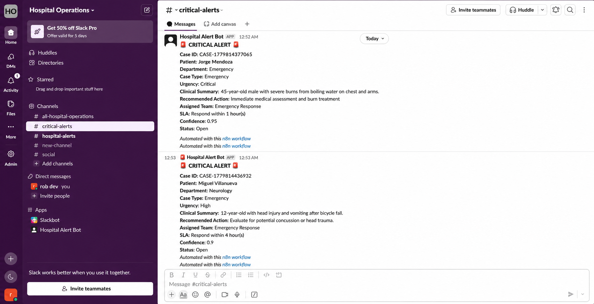
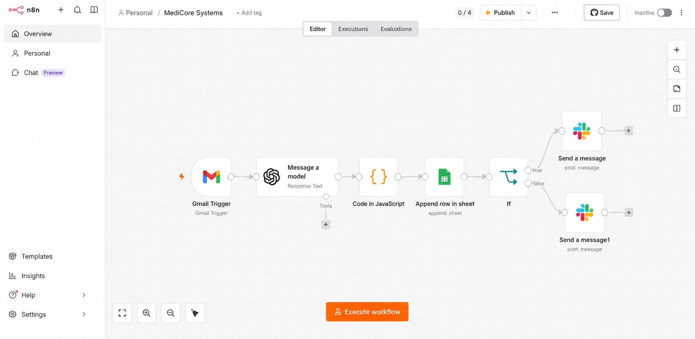
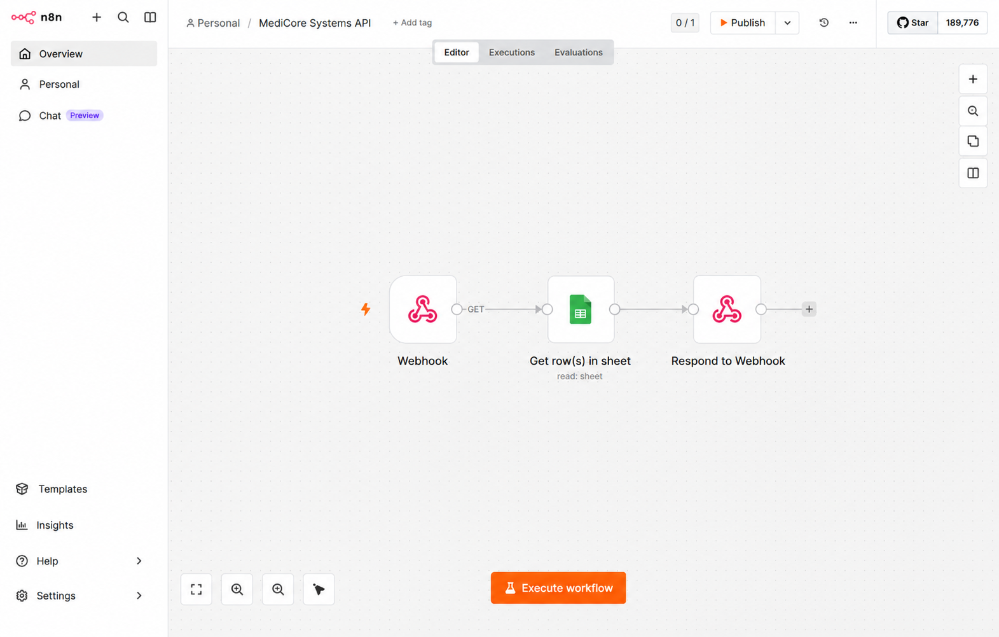

# 🏥 MediCore Systems
### AI-Powered Hospital Operations Platform


> **MediCore Systems** is a fully automated, AI-driven hospital intake and operations platform that processes patient requests from Gmail, classifies urgency in real time, logs structured case data to Google Sheets, and fires Slack alerts — all without human intervention.

---

## 📸 System Screenshots

| Dashboard | Google Sheets Log |
|-----------|------------------|
|  |  |

| Slack — Hospital Alerts | Slack — Critical Alerts |
|------------------------|------------------------|
|  |  |

### 📸 Workflow Screenshots

| Main Intake Pipeline | MediCore Data API |
|---------------------|------------------|
|  |  |

---

## 🧠 What It Does

MediCore automates the entire hospital intake pipeline from the moment a patient emails in:

1. **Email Intake** — Gmail trigger polls for new unread patient emails every minute
2. **AI Classification** — GPT-4o extracts patient name, case type, department, urgency, clinical summary, recommended action, assigned team, confidence score, and SLA
3. **Data Logging** — Structured case rows are appended to a live Google Sheets database
4. **Smart Alerting** — n8n routes alerts to the correct Slack channel:
   - `#hospital-alerts` — for all new intake cases (Normal, Low)
   - `#critical-alerts` — for Critical and High urgency cases only
5. **Live Dashboard** — A standalone HTML dashboard reads from a webhook-exposed Google Sheet and visualizes cases in real time

---

## 📐 Core Concepts

Understanding these concepts is essential to working with or extending MediCore Systems.

### Service Level Agreement (SLA)

An SLA in a hospital context is a **contractual time commitment** — the maximum allowable window between when a patient case is logged and when clinical staff must respond or act. MediCore enforces SLAs automatically by tagging every case with an `sla_timer` value (in hours) derived from its AI-classified urgency level.

> **Why it matters:** Without enforced SLAs, critical cases risk being buried under routine requests. MediCore ensures that urgency always determines response priority — not the order emails arrive in.

| Urgency | SLA Timer | Clinical Rationale |
|---------|-----------|-------------------|
| 🔴 Critical | **1 hour** | Life-threatening conditions (cardiac arrest, stroke, severe burns) where delayed response directly increases mortality risk |
| 🟠 High | **4 hours** | Serious but stabilizable conditions (severe chest pain, difficulty breathing, seizure) requiring prompt clinical attention |
| 🟢 Normal | **24 hours** | Non-urgent medical needs (routine appointments, follow-ups, check-ups) that can be scheduled within the business day |
| 🔵 Low | **72 hours** | Administrative or informational requests (billing, lab results, insurance documents) with no immediate clinical impact |

The `sla_timer` field is written directly to Google Sheets and surfaced on the live dashboard, giving operations staff an at-a-glance view of which cases are approaching their deadline.

---

### Confidence Score

Every case processed by MediCore includes a `confidence_score` — a decimal between `0.0` and `1.0` assigned by GPT-4o to indicate how certain the model is about its own classification.

| Score Range | Interpretation | Recommended Action |
|-------------|---------------|-------------------|
| `0.90 – 1.00` | High confidence | Trust the classification; proceed automatically |
| `0.75 – 0.89` | Moderate confidence | Classification is likely correct; spot-check if time allows |
| `0.50 – 0.74` | Low confidence | Flag for human review before acting |
| `< 0.50` | Uncertain | Treat as unclassified; route to a senior coordinator |

> A low confidence score does not mean the case is unimportant — it means the AI had insufficient information to classify it reliably. Always escalate uncertain high-stakes cases manually.

---

### Skip Logic

Not every email in a hospital inbox is from a patient. MediCore's AI is instructed to detect and **silently discard** non-patient emails (promotional, newsletters, spam, system notifications) by returning `"status": "Skip"`. The JavaScript node then returns an empty array `[]`, which halts the entire downstream workflow — no row is written to Google Sheets, no Slack alert is fired.

This keeps the operations log clean and ensures staff are never distracted by irrelevant notifications.

---

## 🗺️ System Architecture

```
Patient Email (Gmail)
        │
        ▼
  [n8n Gmail Trigger]  ─── polls every minute for unread INBOX emails
        │
        ▼
  [GPT-4o via OpenAI]  ─── extracts & classifies case details
        │
        ▼
  [Code in JavaScript] ─── parses JSON, generates Case ID, filters Skip
        │
        ├──▶ [Google Sheets]  ─── appends structured case row
        │
        └──▶ [If: Urgency == Critical OR High]
                    │
              ┌─────┴──────┐
              ▼            ▼
     #critical-alerts  #hospital-alerts
        (Slack)            (Slack)
```

**Second n8n Workflow — MediCore Data API:**

```
[Webhook GET] ──▶ [Google Sheets: Read Rows] ──▶ [Respond to Webhook]
```

This exposes the live sheet data as a REST API consumed by the dashboard.

---

---

## ⚡ Features

| Feature | Description |
|--------|-------------|
| 🤖 **AI Extraction** | GPT-4o parses unstructured patient emails into structured case objects |
| 🚨 **Urgency Classification** | Critical / High / Normal / Low — with SLA timers (1h / 4h / 24h / 72h) |
| 🏥 **Department Routing** | General, Emergency, Neurology, Cardiology, Orthopedics, Billing, Radiology, ICU |
| 📊 **Live Dashboard** | Real-time stats, donut chart, bar chart, case timeline, and case table |
| 📬 **Slack Bot Alerts** | Hospital Alert Bot posts formatted case cards to the right channels |
| 🗂️ **Google Sheets Log** | Timestamped, filterable database of all intake cases |
| 🔁 **Webhook API** | n8n exposes sheet data as a REST endpoint for the dashboard |
| 🔒 **Confidence Scoring** | Every AI classification includes a 0.0–1.0 confidence score |
| 🚫 **Smart Skip Logic** | Automatically filters and discards non-patient emails |

---

## 📊 Dashboard Overview

The live dashboard provides:

- **KPI Cards** — Total Cases, Critical (SLA: 1h), High (SLA: 4h), Normal/Low (SLA: 24–72h)
- **Cases by Urgency** — Donut chart breakdown with color-coded severity
- **Cases by Department** — Bar chart across all hospital departments
- **Cumulative Cases Over Time** — Line chart showing intake volume trends
- **Recent Cases — Live** — Scrollable table with Case ID, Patient, Department, Urgency badge, AI Summary, Confidence, and SLA
- **Auto-refresh** — Pulls fresh data from Google Sheets every 60 seconds

---

## 🔧 Tech Stack

| Layer | Technology |
|-------|-----------|
| **Trigger** | Gmail (n8n Gmail Trigger node) |
| **AI Engine** | OpenAI GPT-4o (`Message a model` node) |
| **Automation** | n8n (cloud or self-hosted) |
| **Database** | Google Sheets (append + read via n8n) |
| **Alerting** | Slack (Hospital Alert Bot) |
| **API Layer** | n8n Webhook → Google Sheets → Respond to Webhook |
| **Dashboard** | Vanilla HTML + Chart.js |

---

## 🗂️ Google Sheets Schema

| Column | Description |
|--------|-------------|
| `Case ID` | Unique identifier (e.g. `CASE-1779814377065`) |
| `Timestamp` | ISO datetime of intake |
| `Patient Name` | Extracted from email body or signature |
| `Intake Source` | Always `Email` |
| `Case Type` | Emergency / Appointment / Follow-up / Lab Results / Billing |
| `Department` | Routed department |
| `Urgency Level` | Critical / High / Normal / Low |
| `AI Clinical Summary` | GPT-4o one-sentence plain-language summary |
| `Recommended Action` | Suggested next step for staff |
| `Assigned Team` | Emergency Response / General Practice / Cardiology Team / Billing Department |
| `Status` | Open / Skip |
| `Confidence Score` | 0.00–1.00 |
| `SLA Timer (hrs)` | 1 / 4 / 24 / 72 |

---

## 🚀 n8n Workflows

### 1. `MediCore Systems` — Main Intake Pipeline

| Node | Role |
|------|------|
| Gmail Trigger | Polls INBOX for unread emails every minute |
| Message a model (GPT-4o) | Classifies and extracts structured case data |
| Code in JavaScript | Parses AI JSON output, generates Case ID, filters Skip |
| Append row in sheet | Logs structured case row to Google Sheets |
| If | `Urgency Level == Critical OR High` → true branch; else → false branch |
| Send a message ×2 | Posts to `#critical-alerts` or `#hospital-alerts` |

### 2. `MediCore Systems API` — Dashboard Data Feed

| Node | Role |
|------|------|
| Webhook (GET) | Exposes a GET endpoint for the dashboard |
| Get row(s) in sheet | Reads all rows from the MediCore Google Sheet |
| Respond to Webhook | Returns rows as JSON to the dashboard |

---

## 🤖 AI Prompt — GPT-4o System Instruction

The exact prompt used in the **`Message a model`** n8n node:

```
You are a hospital operations AI assistant. Carefully analyze the patient email below
and extract structured intake information for the hospital operations log.

From: {{ $json.from }}
Subject: {{ $json.subject }}
Email: {{ $json.text || $json.snippet }}

FIRST - Check if this is a real patient email. If the email is any of the following,
set status to "Skip":
- Promotional or marketing email
- Newsletter or subscription email
- Sales or discount offer
- Shipping or order confirmation
- Spam or unrelated content
- Auto-generated system email
- Any email NOT from a real patient about a medical concern

Rules:
- Be concise and clinical in tone.
- If information is missing or unclear, make a reasonable inference based on context.
- confidence_score must be a decimal between 0.0 and 1.0.
- sla_timer is in hours: Critical = 1, High = 4, Normal = 24, Low = 72.
- assigned_team should reflect the most appropriate staff group.
- patient_name should be extracted in this priority order:
  1. Explicit "Patient Name:" field in the email body
  2. Full name from email signature (after "Regards," "Sincerely," "Thank you," etc.)
  3. Full name mentioned in the email body
  4. Full name from the From field ONLY if not a forwarded email
  5. "Unknown" if no name found at all
- If the email is a forwarded message, extract patient details from the forwarded
  content body, NOT from the From field.
- intake_source is always "Email".
- status is "Open" for real patient emails, "Skip" for non-patient emails.

Urgency classification — follow STRICTLY, no exceptions:
- Critical: Immediately life-threatening ONLY — cardiac arrest, stroke, unconscious,
  stopped breathing, severe burns, no pulse
- High: Serious but stabilizable — high fever WITH complications, seizure,
  hypoglycemia, severe chest pain, difficulty breathing
- Normal: Non-urgent medical needs — appointments, follow-ups, billing questions,
  check-ups, physical exams, general medical inquiries
- Low: Administrative requests ONLY — lab result requests, general inquiries,
  prescription refill requests, insurance documents, medical certificates,
  vaccination inquiries

Return ONLY this exact JSON, no backticks, no markdown, no explanation:
{
  "patient_name": "extracted name or Unknown",
  "intake_source": "Email",
  "case_type": "Appointment|Emergency|Billing|Lab Results|Follow-up|Non-Patient",
  "department": "Cardiology|Neurology|Orthopedics|General|Billing|Radiology|ICU|Emergency",
  "urgency": "Critical|High|Normal|Low",
  "ai_clinical_summary": "one sentence clinical summary",
  "recommended_action": "short specific action for staff",
  "assigned_team": "ICU Team|Emergency Response|Cardiology Team|Billing Department|General Practice",
  "status": "Open|Skip",
  "confidence_score": 0.0,
  "sla_timer": 0
}
```

> **Why this works:** The prompt enforces strict JSON-only output, handles spam filtering via `status: "Skip"`, uses a priority-ordered name extraction strategy, strictly separates urgency tiers with no grey areas, and injects the live Gmail content via n8n expressions at runtime.

---

## 🟨 JavaScript Node — `Code in JavaScript`

After GPT-4o returns its response, this n8n Code node parses the output, generates a unique Case ID, filters out non-patient emails, and passes the structured data downstream to Google Sheets and Slack:

```javascript
const item = $input.first().json;

// Support multiple OpenAI response shapes
const text =
  item.json?.message?.content?.[0]?.text ||
  item.output?.[0]?.content?.[0]?.text ||
  item.content?.[0]?.text ||
  "";

// Strip markdown code fences if present
const raw = text.replace(/```json/g, "").replace(/```/g, "").trim();

let data;
try {
  data = JSON.parse(raw);
} catch(e) {
  return []; // Drop malformed responses silently
}

// Generate unique Case ID using current timestamp
data.case_id = `CASE-${Date.now()}`;

// Filter out non-patient emails — halts all downstream nodes
if (data.status === "Skip" || data.patient_name === "SKIP") {
  return [];
}

return [{ json: data }];
```

**Key logic:**
- Multiple response shape fallbacks — handles different OpenAI API response structures
- `status === "Skip"` — returns `[]`, halting the workflow with zero downstream side effects
- `CASE-` + `Date.now()` — generates a collision-resistant unique case identifier
- All fields pass downstream to both the Google Sheets append node and Slack alert nodes

---

## 🔀 If Node — Urgency-Based Slack Routing

After the case row is appended to Google Sheets, the **If** node evaluates urgency and forks the workflow:

```
[If Node]
    │
    ├── TRUE  (Critical OR High) ──▶ Send a message → #critical-alerts
    │
    └── FALSE (Normal or Low)   ──▶ Send a message → #hospital-alerts
```

### Conditions (n8n If Node config)

| # | Expression | Operator | Value |
|---|-----------|----------|-------|
| 1 | `{{ $json['Urgency Level'] }}` | is equal to | `Critical` |
| OR | | | |
| 2 | `{{ $json['Urgency Level'] }}` | is equal to | `High` |

> **Note:** Both conditions use **OR** logic — if either is true, the alert goes to `#critical-alerts`. All Normal and Low cases fall through to `#hospital-alerts`.

---

## 💬 Slack Message Templates

### `#critical-alerts` — Critical & High urgency

```
🚨 *CRITICAL ALERT* 🚨

*Case ID:* {{$json['Case ID']}}
*Patient:* {{$json['Patient Name']}}
*Department:* {{$json['Department']}}
*Case Type:* {{$json['Case Type']}}
*Urgency:* {{$json['Urgency Level']}}
*Clinical Summary:* {{$json['AI Clinical Summary']}}
*Recommended Action:* {{$json['Recommended Action']}}
*Assigned Team:* {{$json['Assigned Team']}}
*SLA:* Respond within {{$json['SLA Timer (hrs)']}} hour(s)
*Confidence:* {{$json['Confidence Score']}}
*Status:* {{$json['Status']}}
_Automated with this n8n workflow_
```

### `#hospital-alerts` — Normal & Low urgency

```
📋 NEW INTAKE CASE

Case ID: {{ $('Code in JavaScript').item.json.case_id }}
Patient Name: {{ $('Code in JavaScript').item.json.patient_name }}
Case Type: {{ $('Code in JavaScript').item.json.case_type }}
Department: {{ $('Code in JavaScript').item.json.department }}
Urgency: {{ $('Code in JavaScript').item.json.urgency }}
Clinical Summary: {{ $('Code in JavaScript').item.json.ai_clinical_summary }}
Recommended Action: {{ $('Code in JavaScript').item.json.recommended_action }}
Assigned Team: {{ $('Code in JavaScript').item.json.assigned_team }}
SLA: Respond within {{ $('Code in JavaScript').item.json.sla_timer }} hour(s)
Confidence: {{ $('Code in JavaScript').item.json.confidence_score }}
Status: {{ $('Code in JavaScript').item.json.status }}
```

> **Note:** Critical alerts reference `$json['Column Name']` (post-Sheets data). Normal/Low alerts reference `$('Code in JavaScript').item.json` directly (pre-Sheets), since the If node branches before the Sheets append for the false path.

---

## 🛡️ SLA Policy

| Urgency | SLA | Slack Channel |
|---------|-----|--------------|
| 🔴 Critical | Respond within **1 hour** | `#critical-alerts` |
| 🟠 High | Respond within **4 hours** | `#critical-alerts` |
| 🟢 Normal | Respond within **24 hours** | `#hospital-alerts` |
| 🔵 Low | Respond within **72 hours** | `#hospital-alerts` |

---

## 📦 Setup

### Prerequisites
- n8n instance (cloud or self-hosted)
- Google account with Sheets + Gmail access
- OpenAI API key (GPT-4o access)
- Slack workspace with a bot app configured

### Steps

1. **Clone this repo**
   ```bash
   git clone https://github.com/robdev37/medicore-systems.git
   cd medicore-systems
   ```

2. **Import n8n workflows**
   - Import `workflows/medicore-main-workflow.json`
   - Import `workflows/medicore-api-workflow.json`

3. **Configure credentials in n8n**
   - Gmail OAuth2
   - OpenAI API key
   - Google Sheets OAuth2
   - Slack Bot Token

4. **Set up Google Sheets**
   - Create a new Google Sheet
   - Add column headers matching the schema above
   - Update the Sheet ID in both n8n workflows

5. **Configure Slack**
   - Create a Slack app with `chat:write` permissions
   - Create channels: `#hospital-alerts` and `#critical-alerts`
   - Add the bot to both channels
   - Update channel IDs in the n8n workflow

6. **Configure the Dashboard**
   - Open `dashboard/index.html`
   - Replace the `API` variable with your deployed n8n MediCore API webhook URL
   - Open the file in any browser — no build step required

7. **Activate workflows in n8n and go live**

---

## 📁 Project Structure

```
medicore-systems/
├── README.md
├── .gitignore
├── workflows/
│   ├── medicore-main-workflow.json     # Main intake pipeline
│   └── medicore-api-workflow.json      # Dashboard data API
├── dashboard/
│   └── index.html                      # Live dashboard (Chart.js)
└── docs/
    ├── dashboard-preview.png
    ├── sheets-preview.png
    ├── n8n-workflow.png
    ├── n8n-api-workflow.png
    ├── slack-hospital-alerts.png
    └── slack-critical-alerts.png
```

---

## 🤝 Contributing

Pull requests are welcome. For major changes, please open an issue first to discuss what you would like to change.

---

## 📄 License

[MIT](LICENSE)

---

> Built with ❤️ — Automating hospital operations so staff can focus on patients, not paperwork.
